<p align="center">
  
</p>

<h1 align="center">Socketify</h1>

<p align="center">
  <strong>A fast, modern C++20 HTTP/HTTPS server &amp; routing framework</strong><br>
  Express-style ergonomics on an epoll event loop with zero-copy file serving.
</p>

<p align="center">
  
  
  
  
  
  
  
  
</p>

<p align="center">
  <code>http</code> · <code>https</code> · <code>rest-api</code> · <code>middleware</code> · <code>sse</code> ·
  <code>pulse</code> · <code>websocket</code> · <code>sessions</code> · <code>cors</code> · <code>rate-limit</code> ·
  <code>gzip</code> · <code>static-files</code> · <code>sendfile</code> · <code>json</code> · <code>multipart</code> ·
  <code>cookies</code> · <code>high-performance</code> · <code>zero-copy</code> ·
  <code>web-framework</code> · <code>backend</code> · <code>cpp20</code> · <code>cmake</code>
</p>

---

## Quick taste

```cpp
#include <socketify/socketify.h>
using namespace socketify;

int main() {
    Server server;

    server.Get("/", [](Request&, Response& res) {
        res.send("Hello, world!\n");
    });

    server.Get("/users/:id", [](Request& req, Response& res) {
        res.json({{"id", req.params().at("id")}});
    });

    server.Listen(8080);
    server.Wait();
}
```

## Features

- **HTTP/1.1** — keep-alive, pipelining, chunked transfer decoding,
  `Expect: 100-continue`, configurable header/body limits and timeouts
- **HTTPS** — TLS 1.2+ via OpenSSL, cert/key from files or environment,
  one code path for HTTP and HTTPS
- **Routing** — `:params`, `*wildcards`, route groups, per-route and global
  middleware, automatic `HEAD` fallback and 405 handling
- **Request/response** — lazy query/cookie parsing, JSON body
  (`nlohmann::json`), urlencoded forms, multipart file uploads,
  streaming/chunked responses, redirects
- **Static files** — zero-copy `sendfile(2)`, ETag/Last-Modified,
  Range requests, directory indexes, SPA fallthrough
- **Middleware built-ins** — request logging, request IDs, CORS,
  token-bucket rate limiting (`RateLimit-*` headers), gzip/deflate
  compression, body-size limits
- **Sessions** — pluggable manager: server store, signed cookie, or JWT
  (cookie / Bearer); rolling TTL, `regenerate()`, default MemoryStore
- **ORM / database** — `socketify::db` models & schema DSL for SQLite,
  PostgreSQL, MySQL; MongoDB documents (`memory://` or mongo-cxx); migrations,
  validations, hooks, relations, pools, transactions
- **Server-Sent Events** — `sse::upgrade()` with a thread-safe session
  handle for pushing events from any thread
- **Pulse** — bidirectional realtime channels (`pulse::upgrade` / `Channel` /
  `Hub`); RFC 6455 WebSocket under the hood so browsers and `wscat` work
  unchanged (`ws://` / `wss://`)
- **Performance architecture** — one epoll loop per worker thread,
  `SO_REUSEPORT` listeners (no accept contention), non-blocking sockets,
  buffered writes, timer-based connection expiry

## Benchmarks

Same machine, same endpoint, same load tool — **Socketify vs Express / Flask / Django**.

| | |
|---|---|
| **What** | `GET /ping` → `{"ok":true}` (no DB, no templates) |
| **How** | [wrk](https://github.com/wg/wrk) `-t4 -c100 -d8s`, localhost keep-alive |
| **Where** | Intel i7-12700K · 20 threads · Linux · 2026-07-20 |

### Throughput — requests / second

<p align="center">
  
</p>

| Rank | Framework | req/s | vs Socketify |
|:---:|---|---:|---:|
| 1 | **Socketify** (C++20 · epoll) | **909,254** | — |
| 2 | Express 4 (Node.js) | 61,208 | **~15× slower** |
| 3 | Flask 3 + Waitress | 1,862 | **~488× slower** |
| 4 | Django 4 + Waitress | 1,202 | **~757× slower** |

### Latency — p99 (lower is better)

<p align="center">
  
</p>

| Framework | avg | p50 | p99 |
|---|---:|---:|---:|
| **Socketify** | **0.080 ms** | **0.054 ms** | **0.124 ms** |
| Express | 1.98 ms | 1.57 ms | 2.30 ms |
| Django | 82.5 ms | 90.5 ms | 123 ms |
| Flask | 86.3 ms | 51.6 ms | 1140 ms |

Charts are animated SVGs with a **transparent background** (labels adapt to light/dark themes).

<details>
<summary><strong>Methodology, public benchmarks &amp; how to reproduce</strong></summary>

<br>

**Why Socketify wins this test:** native C++20, epoll + `SO_REUSEPORT` workers, almost no per-request overhead. Interpreted stacks (Node / Python) pay runtime and middleware costs even on a trivial handler.

**Public suites (different hardware — order only):**

| Source | Express | Flask | Django |
|---|---:|---:|---:|
| [Sharkbench](https://sharkbench.dev/web/python) (2025-08) | ~5,766 | ~1,092 | ~950 |
| [Commodity `/ping` write-up](https://augustinejoseph.medium.com/fastapi-vs-django-vs-django-ninja-vs-fastify-vs-express-a-real-world-performance-benchmark-on-0b0fd1db9eb0) | ~6,500 | — | much lower w/ default middleware |

> Micro-benchmarks ≠ production apps (DB, auth, business logic dominate there). Always measure *your* workload. Raw JSON: [`benchmarks/results.json`](benchmarks/results.json).

```bash
./benchmarks/run_all.sh
# optional: DURATION=10 CONCURRENCY=200 ./benchmarks/run_all.sh
```

</details>

## Requirements

| Dependency | Notes |
|---|---|
| Linux | epoll / `sendfile` / `SO_REUSEPORT` |
| C++20 compiler | GCC 12+ or Clang 15+ |
| CMake | ≥ 3.16 |
| [nlohmann_json](https://github.com/nlohmann/json) | ≥ 3.11 |
| ZLIB | gzip / deflate |
| OpenSSL 1.1.1+ | optional; only when `SOCKETIFY_WITH_TLS=ON` (default) |

```bash
# Debian / Ubuntu
sudo apt install build-essential cmake ninja-build \
    nlohmann-json3-dev zlib1g-dev libssl-dev
```

## How to build

### 1. Clone (with examples submodules)

Ripple and other showcase apps live as **git submodules** under `examples/`.
Clone with recursion so they come along:

```bash
git clone --recurse-submodules https://github.com/MSaLeHNYM/Socketify.git
cd Socketify
```

Already cloned without submodules?

```bash
git submodule update --init --recursive
```

### 2. Configure & build (Release)

```bash
cmake -S . -B build -DCMAKE_BUILD_TYPE=Release \
    -DSOCKETIFY_BUILD_EXAMPLES=ON
cmake --build build -j$(nproc)
```

Or use the helper script:

```bash
./scripts/build_release.sh
```

### 3. Debug build + sanitizers + tests

```bash
./scripts/build_debug.sh
# equivalent to:
#   cmake -S . -B build-debug -DCMAKE_BUILD_TYPE=Debug \
#       -DSOCKETIFY_BUILD_TESTS=ON \
#       -DSOCKETIFY_SANITIZE=address,undefined
#   cmake --build build-debug -j$(nproc)
#   ctest --test-dir build-debug --output-on-failure
```

### 4. Install (optional)

```bash
cmake --install build --prefix /usr/local
# then in your app:
#   find_package(Socketify 0.2 REQUIRED)
#   target_link_libraries(app PRIVATE Socketify::socketify)
```

### CMake options

| Option | Default | Meaning |
|---|---|---|
| `SOCKETIFY_WITH_TLS` | `ON` | HTTPS support (needs OpenSSL) |
| `SOCKETIFY_WITH_SQLITE` | `ON` | SQLite driver for `socketify::db` |
| `SOCKETIFY_WITH_POSTGRES` | `OFF` | PostgreSQL driver (libpq) |
| `SOCKETIFY_WITH_MYSQL` | `OFF` | MySQL driver (libmysqlclient) |
| `SOCKETIFY_WITH_MONGO` | `OFF` | MongoDB driver (mongo-cxx); `memory://` always available |
| `SOCKETIFY_BUILD_EXAMPLES` | `OFF` | Build `examples/` |
| `SOCKETIFY_BUILD_TESTS` | `OFF` | Build GoogleTest suite |
| `SOCKETIFY_BUILD_DOCS` | `OFF` | Add a `docs` Doxygen target |
| `SOCKETIFY_SANITIZE` | *(empty)* | e.g. `address,undefined` |
| `SOCKETIFY_WERROR` | `OFF` | Treat warnings as errors |

Convenience scripts:

| Script | What it does |
|---|---|
| `scripts/build_release.sh` | Optimized Release build (+ examples) |
| `scripts/build_debug.sh` | Debug + ASan/UBSan + tests |
| `scripts/run_tests.sh` | Build (if needed) and run CTest |
| `scripts/run_examples.sh [01-07]` | Build & run one graded example |
| `scripts/serve_docs.sh [port]` | Generate Doxygen docs, serve on localhost, open browser |

## Using it in your project

After `cmake --install build`:

```cmake
find_package(Socketify 0.2 REQUIRED)
target_link_libraries(app PRIVATE Socketify::socketify)
```

Or add Socketify as a subdirectory / FetchContent and link `Socketify::socketify`.

## Examples — a graded tour

| Example | Shows |
|---|---|
| [`01_hello_world`](examples/01_hello_world) | routes, path params, JSON |
| [`02_rest_api`](examples/02_rest_api) | CRUD API, groups, body parsing, status codes |
| [`03_middleware`](examples/03_middleware) | logging, CORS, rate limit, sessions, custom auth |
| [`04_static_site`](examples/04_static_site) | static files, compression, SPA fallback |
| [`05_sse_chat`](examples/05_sse_chat) | live feed over Server-Sent Events |
| [`06_https`](examples/06_https) | TLS with a self-signed dev cert |
| [`07_fullstack`](examples/07_fullstack) | everything combined: frontend + API + sessions + SSE |
| [`08_nexus_board`](examples/08_nexus_board) | **React + SQLite app**: auth, projects, kanban, uploads, live SSE |
| [`09_orm_demo`](examples/09_orm_demo) | `socketify::db` ORM: models, relations, migrations, Mongo documents |
| [`10_pulse_chat`](examples/10_pulse_chat) | lobby chat over Pulse (browser `WebSocket` + `pulse::Hub`) |
| [`ripple`](examples/ripple) | **[Ripple](https://github.com/MSaLeHNYM/ripple)** — Telegram-style messenger (Pulse + SQLite + React) · *submodule* |

<p align="center">
  <a href="https://github.com/MSaLeHNYM/ripple">
    
  </a>
</p>

<p align="center">
  <strong><a href="https://github.com/MSaLeHNYM/ripple">Ripple</a></strong> — <em>Messages that ripple.</em><br>
  Full messenger showcase: accounts, DMs, groups, presence, typing indicators.<br>
  Built with Socketify Pulse + <code>db</code> ORM (SQLite) + React · MIT licensed.
</p>

```bash
./scripts/run_examples.sh 07       # fullstack guestbook
./scripts/run_examples.sh 10       # Pulse lobby chat
./scripts/run_examples.sh ripple   # Ripple messenger → http://localhost:8080
```

## Tests

177 unit and integration tests (GoogleTest), run under
AddressSanitizer/UBSan in the debug build:

```bash
./scripts/run_tests.sh
```

## Documentation

- Hand-written guide: <a href="docs/API.md">docs/API.md</a>
- **API reference (local only)** — generate with the script; HTML is written
  to `docs/generated/` which is **gitignored** (not pushed to GitHub):

```bash
./scripts/serve_docs.sh          # regen + http://127.0.0.1:8765/
./scripts/serve_docs.sh 9000     # custom port
./scripts/serve_docs.sh --regen-only
```

Requires `doxygen` on `PATH` (or under `.deps/sysroot/usr/bin/doxygen`).

## Roadmap

- Pulse permessage-deflate (optional compression extension)
- HTTP/2 (ALPN, h2c)
- Pluggable auth helpers (JWT, HMAC)
- Redis-backed session/rate-limit stores
- OpenTelemetry exporter

## License & copyright

**Copyright © 2025–2026 M SaLeH NYM. All rights reserved.**

Socketify is released under a **source-available** license (see [LICENSE](LICENSE)):

| You **may** | You **may not** (without written permission) |
|---|---|
| Use Socketify as a library to build & ship **your own apps** | Modify / fork / redistribute **changed** copies of Socketify |
| Link statically or dynamically against an **unmodified** build | Treat Socketify as open-source-to-relicense |

**Want to contribute a patch?** Ask first — email
[saleh.ue4@gmail.com](mailto:saleh.ue4@gmail.com) or Telegram
[t.me/MSaLeHNYM](https://t.me/MSaLeHNYM) for permission. Approved
contributions are assigned to the copyright holder so ownership stays unified.

All copyright and legal ownership of this software belong exclusively to
**M SaLeH NYM**.
